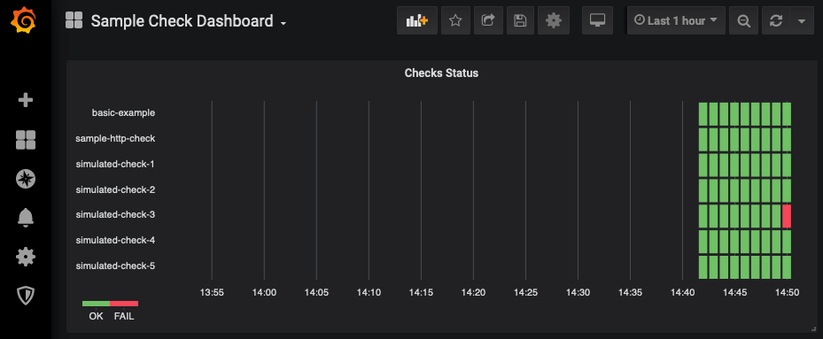

# Getting Started with a sample instance using docker-compose
The example-usage directory provides a docker-compose file with some sample checks, configured to write output to stdout and influxdb.
The compose file includes both influxdb and grafana, along with a sample dashboard you can import.
It uses the [Statusmap plugin](https://grafana.com/grafana/plugins/flant-statusmap-panel), which is installed via the docker-compose configuration.

### Initial local setup instructions
1. Run the apps: `docker-compose up`
2. After seeing some logs from the influx and grafana containers starting up, you should see chaperone execute some sample checks every minute like this:  
```
chaperone_1  | 2020-02-17 20:41:04,291 INFO  c.writer.InfluxDbWriter |  influxdb config: db: metrics, uri: http://influxdb:8086, defaultTags: {app=myapp-chaperone}
chaperone_1  | 2020-02-17 20:41:04,320 INFO  i.m.i.InfluxMeterRegistry |  publishing metrics to influx every 1m
chaperone_1  | 2020-02-21T01:20:02.372945Z      simulated-check               OK   {env=dev}                simulated pass
chaperone_1  | 2020-02-21T01:20:02.374014Z      basic-example                 OK   {env=dev}                basic-example.toml
chaperone_1  | 2020-02-21T01:20:02.530046Z      template example - a          OK   {letter=a, env=test}     a
chaperone_1  | 2020-02-21T01:20:02.531372Z      template example - b          OK   {letter=b, env=test}     b
chaperone_1  | 2020-02-21T01:20:02.532529Z      template example - c          OK   {letter=c, env=test}     c
chaperone_1  | 2020-02-21T01:20:02.904204Z      sample-http-check             OK   {env=dev}
```
The simulated check is configured to randomly fail about 1% of the time, so occasionally you should see some FAIL scenarios for that one.

2. Now let's get grafana working.  Navigate to the local grafana instance at http://localhost:3000  
Default User: `admin/admin`
3. Create a new InfluxDB datasource.  
Url: `http://influxdb:8086`  
Database: `metrics` (it takes a minute for the database to be created by the app, but should get automatically created)
4. After successfully saving and testing the datasource, create a new dashboard using the `+ -> Import` action. Select the `Sample Check Dashboard-xxx.json` file located in this directory.

After importing the dashboard, you should see it being populated with data that looks something like this:  


That's it!

Also included is an [example dashboard](example-usage/Sample Check Dashboard-1581612802772.json) you can import that contains a panel configured to send alerts if the check results have failed upon successive failures.
